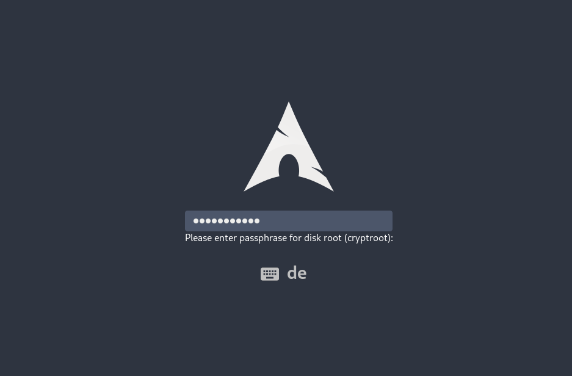

# plymouth-theme-arch-elegant

<p></p>

## Install Dependencies

```
sudo pacman -S git plymouth cantarell-fonts
```

## Install Theme

```
# Clone repo
git clone https://github.com/murkl/plymouth-theme-arch-elegant.git

# Change dir
cd plymouth-theme-arch-elegant

# Add to plymouth themes dir
sudo cp -r ./arch-elegant/ /usr/share/plymouth/themes/arch-elegant

# Set as default theme and rebuild
sudo plymouth-set-default-theme -R arch-elegant
```

## Remove Theme

```
sudo rm -r /usr/share/plymouth/themes/arch-elegant
sudo plymouth-set-default-theme -R bgrt
```

## Size

- Watermark size: `150x150`
- Total entry size: `340x34`
- Lock size: `8x34`
- Entry size: `332x34`

## Colors

- Background: `#2e3440ff`
- Foreground light: `#eeedecff`
- Foreground dark: `#4c566aff`
